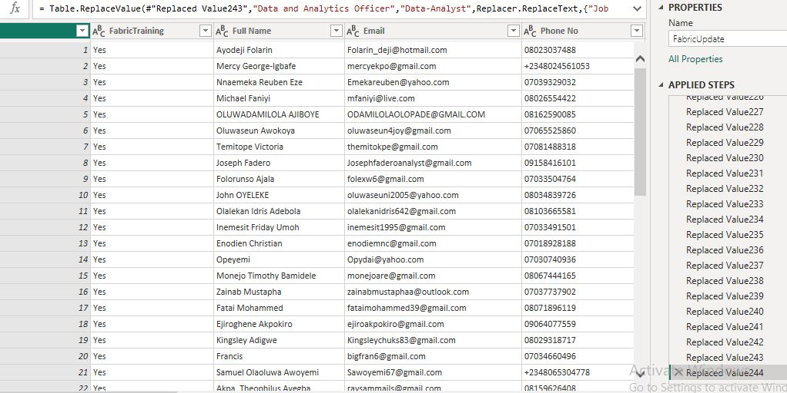
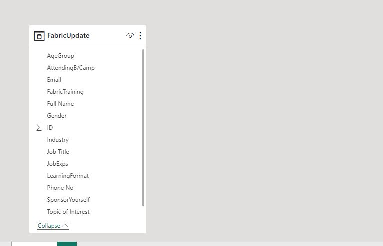
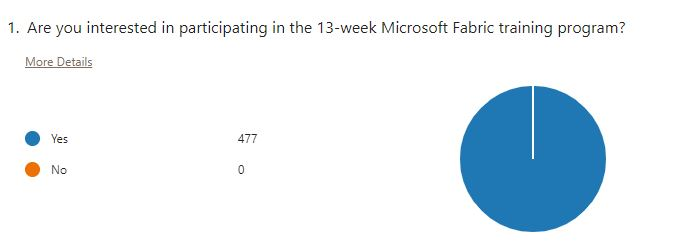
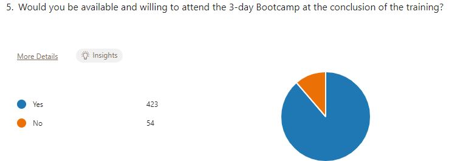

# 9JA Data Platform 13-Week Microsoft Fabric Survey Report
---

## Introduction
---
Welcome to the survey report for the 13-week Microsoft Fabric Series, organized by 9JA Data Platform, formerly known as Power BI Naija. This digital transformation platform offers free training on Microsoft tools as a way of giving back to the community. This series, titled Datafluence 2.0, is a follow-up to our previous successful event in 2023.

Upon my appointment as the Community Lead, I was entrusted with the task of overseeing this initiative. I am excited to embark on this journey as we explore the vast realm of data technology and uncover the innovative capabilities of Microsoft Fabric.

## About Microsoft Fabric:
---
Microsoft Fabric, launched in May 2023, represents a groundbreaking advancement in data management and integration solutions. With its robust features and functionalities, Microsoft Fabric offers unparalleled opportunities for organizations to streamline their data processes and unlock valuable insights.

## Our Objectives:
---
Over the next 13 weeks, our series aims to achieve the following objectives:
- Education and Exploration: Provide participants with a comprehensive understanding of Microsoft Fabric, its key features, and practical applications across various industries.
- Skill Development: Offer hands-on workshops, expert sessions, and practical exercises to enhance participants' skills in utilizing Microsoft Fabric effectively.
- Community Engagement: Foster a vibrant community of data enthusiasts, professionals, and learners through networking opportunities, collaborative projects, and knowledge sharing.

## Meet Our Team:
---
I am delighted to introduce our dedicated team members who will be instrumental in ensuring the success of this series:
Popoola Isiaka (Program Manager): With his expertise in project management, Popoola will oversee the seamless execution of our series, ensuring that each session runs smoothly and efficiently.
Stephenie Ideho (Social Media Manager): Stephenie will be responsible for amplifying our online presence across platforms such as our website, YouTube, and LinkedIn, keeping our audience engaged and informed about our activities.
Dosumu Temitope Adebayo is in charge of designing our Graphics and Fliers to give the event an amazing outlook

## Bootcamp Sessions:
In addition to our series, we will also be organizing boot camp sessions designed to provide intensive training and practical experience with Microsoft Fabric. These sessions will offer participants the opportunity to dive deeper into specific aspects of Microsoft Fabric and gain hands-on experience under the guidance of industry experts.

## Power BI Concepts applied:
- DAX Concepts, 
- CountRows,
- Count,
- Data Cleaning,
- Transformation,
- Loading,
- Visual Formatting

#Problem Statement:
---
### Promoting Fabric Platform for Early Adopters:
Fabric Platform is relatively new, requiring promotion efforts to attract early adopters and increase adoption rates.
### Seamless Collaboration During Data Projects:
Collaboration among data professionals faces challenges as different vendors manage solutions like Azure, Real-time Analytics, and Data Science independently, hindering seamless teamwork.
### Difficulty in Establishing a Single Source of Truth:
Getting data professionals to adopt a single source of truth poses a significant barrier, leading to inefficiencies and inconsistencies in data management and analysis.
### Focus Shift towards Data Engineering on Microsoft Fabric Platform:
There is a growing emphasis on data engineering within the Microsoft Fabric Platform, necessitating attention and resources to address evolving needs in this area.
### Lack of Technical Efficiency and Process Optimization:
Past practices have shown deficiencies in technical efficiency and process optimization, highlighting the need for improvement in these areas to enhance overall performance and productivity.

# Data Gathering
---
I developed a Microsoft Forms survey aimed at Data Professionals to gather insights into their identity, sector of operation, job roles, preferred learning mode, and topics of interest. The survey comprises one table with 20 columns and 477 rows of responses. The survey link is provided below:

Microsoft Form link: ![] ([https://forms.office.com/r/3YTYXqs5Xv])

This survey aims to better understand our audience and tailor our offerings to their needs effectively.

# Data Transformation/Cleaning:
---
Data was efficiently cleaned and transformed with the Power Query Editor of Power BI. [a screenshot of the applied steps] Some of the applied steps included

# Data Modelling 
---
In this project, data modeling requirements are simplified due to the presence of a single table. Therefore, emphasis shifts towards thorough analysis and visualization using Power BI tools. Our objective is to optimize project aspects by leveraging Power BI's capabilities to extract meaningful insights from the data. These insights will inform decision-making processes, enhancing overall planning and execution of the project, which is vital for the 9JA Data Platform community

# Data Analysis and Visuals

# Key Findings from Data Analysis:
---
- High Attendance Assurance: Out of 477 registered attendees, a significant portion indicates assurance of attending the event.

- Gender Distribution: Among attendees, 123 females and 284 males have registered, highlighting a gender distribution imbalance.
  - Broad Industry Interest: Data reveals widespread interest in learning Fabric across various industries.
  
- Learning Format Preferences: Attendees exhibit preferences for learning formats, with 338 opting for recorded sessions, followed by 317 for live sessions, and 311 for interactive workshops.
  
- Topic of Interest: Power BI garners the highest interest with 350 attendees, followed by Data Science with 315, and Data Factory with 233.
  
- BootCamp Participation: While 423 attendees express interest in the 3-day BootCamp, 308 are willing to self-sponsor, and 169 seek scholarships.

These insights will guide planning efforts, informing decisions on accommodation, transportation, volunteer management, and provision of scholarships for eligible candidates.

